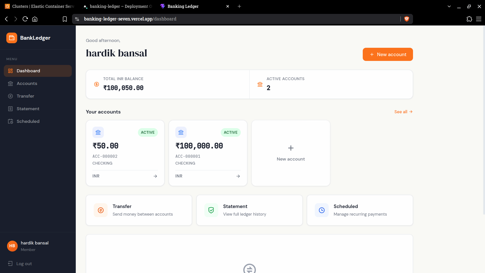
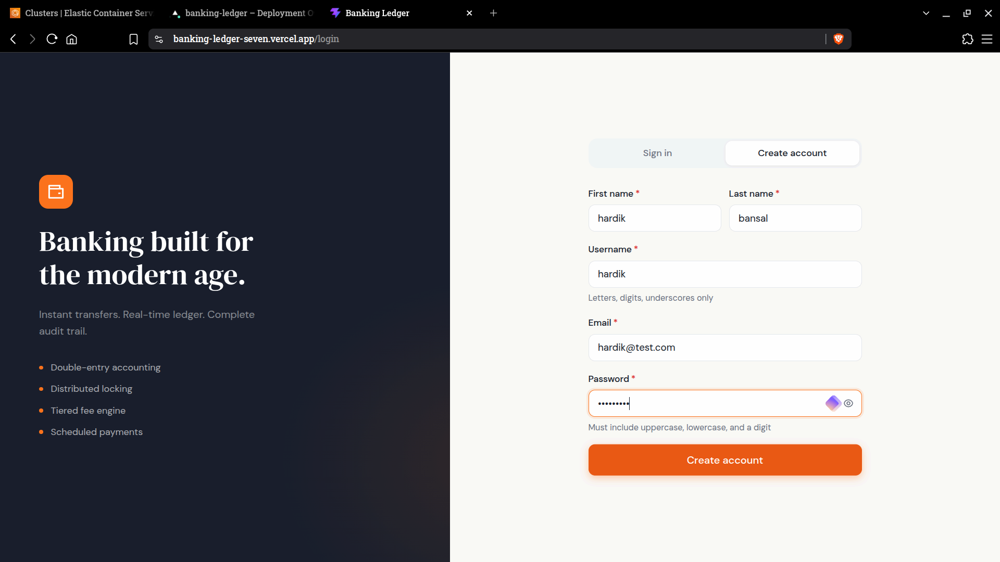
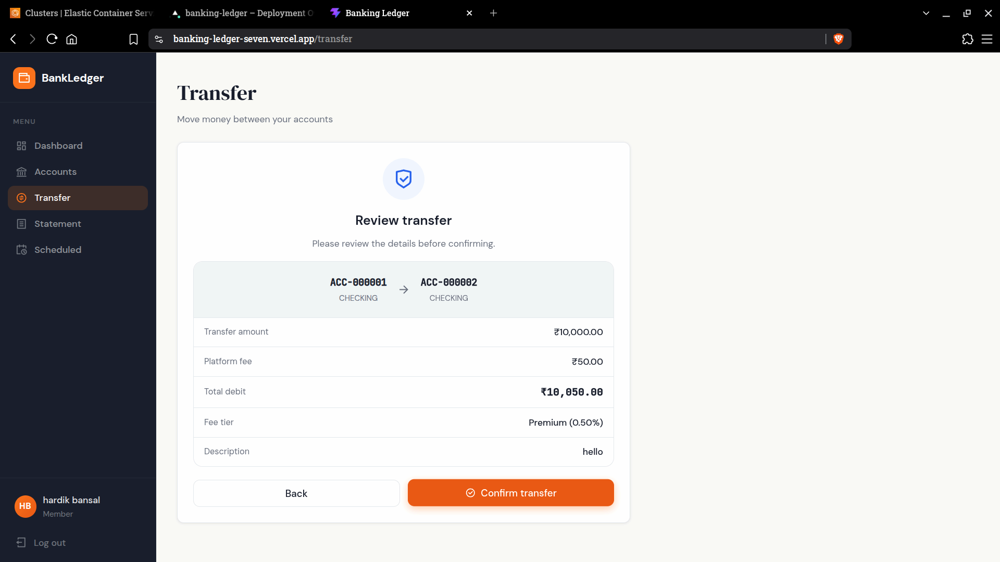

# Banking Core & Distributed Ledger

A high-performance, double-entry banking ledger system built with **Java 21 / Spring Boot 3.5** and **React 19**. Designed for zero money leakage, multi-tier concurrency protection, idempotency, and hybrid cloud deployment.

- **Live Frontend**: [https://banking-ledger-seven.vercel.app/](https://banking-ledger-seven.vercel.app/)
- **Live Backend API**: [https://doobbl97fb0lb.cloudfront.net/api/v1/actuator/health](https://doobbl97fb0lb.cloudfront.net/api/v1/actuator/health)

Built as a portfolio project targeting backend engineering roles.

## Screenshots

<p align="center">
  
</p>
<p align="center">
  
  
</p>

---

## Technical Highlights & Engineering Decisions

### 1. 3-Tier Concurrency Control & Double-Spend Prevention
To prevent race conditions, double-spending, and deadlocks when processing simultaneous fund transfers across distributed instances:

1. **Outer Guard — Distributed Redisson Lock**: Acquired at the controller level (outside `@Transactional`) using Redis distributed locks (`RLock`). Prevents duplicate requests across horizontally scaled app instances before opening a database connection.
2. **Middle Guard — DB Pessimistic Row Locking (`SELECT FOR UPDATE`)**: Acquired inside the transaction. To prevent database deadlocks when two accounts transfer funds to each other simultaneously, account locks are always acquired in **sorted Account UUID order**.
3. **Inner Guard — Optimistic Locking (`@Version`)**: JPA version checks catch edge cases and throw `OptimisticLockingFailureException` if concurrent modifications slip past outer guards.

### 2. Immutable Double-Entry Accounting Engine
* **Atomic Transactions**: Every financial transfer generates exactly two immutable `LedgerEntry` records (`DEBIT` on source, `CREDIT` on destination) committed atomically inside a single `@Transactional` boundary. Money is strictly conserved.
* **Strict Immutability**: The `@PreUpdate` lifecycle hook on `LedgerEntry` entities throws an `IllegalStateException` if Hibernate attempts an `UPDATE`. Corrections require explicit reversal entries.
* **Exact Financial Precision**: All monetary values use Java `BigDecimal` with `RoundingMode.HALF_EVEN` (banker's rounding) to prevent IEEE 754 floating-point cumulative rounding errors.

### 3. Hybrid Cloud Infrastructure & Zero-Cost SSL Proxy
* **Cost-Efficient Topography**: Hosted on **AWS ECS Fargate**, **RDS MySQL 8.4**, and **ElastiCache Redis 7.2** provisioned via **Terraform IaC**.
* **SSL Termination via CloudFront**: Solves browser HTTPS Mixed-Content blocking from Vercel by routing requests through CloudFront with free `*.cloudfront.net` SSL termination to an HTTP Application Load Balancer.
* **NAT-Less VPC Design**: ALB and ECS containers span public subnets with strict security group isolation to enable direct container image pulls from ECR without incurring costly AWS NAT Gateway hourly fees.

### 4. Enterprise Resilience & Standards
* **Idempotency Guarantee**: Accepts `idempotencyKey` headers on transfers. Idempotent requests are cached in Redis to prevent duplicate processing from network retries.
* **RFC 7807 Standardized Errors**: API exceptions return structured `ProblemDetail` payloads containing machine-readable error types, details, and correlation request IDs.
* **MDC Request Tracing**: Every inbound request is assigned a unique `requestId` via an HTTP filter, injected into the `MDC` context, and included in every log statement and `X-Request-Id` response header.

---

## Architecture & Request Flow

```text
Client (React 19 / Vercel)
        │ (HTTPS)
        ▼
Amazon CloudFront (SSL Termination)
        │ (HTTP / ALB)
        ▼
AWS ECS Fargate (Spring Boot 3.5)
  ├── 1. MdcRequestLoggingFilter    ──► Injects unique requestId into MDC
  ├── 2. JwtAuthenticationFilter    ──► Validates JWT Bearer & Redis Token Blacklist
  └── 3. SecurityFilterChain        ──► Enforces RBAC (ROLE_USER, ROLE_ADMIN)
        ↓
  TransactionController
        │
        ├── Acquires Redisson Distributed Lock (sorted lock keys)
        ▼
  LedgerService (@Transactional)
        ├── Acquired DB Pessimistic Lock (`SELECT FOR UPDATE` in sorted account order)
        ├── FeeEngine (Calculates tiered fees)
        ├── ExchangeRateService (WebClient + Redis 60-min cache)
        └── TransactionStateMachine (PENDING ──► AUTHORIZED ──► SETTLED)
        ↓
  MySQL 8.4 (Atomic commit of DEBIT + CREDIT LedgerEntries)
```

---

## Tech Stack

| Layer | Technology | Selection Rationale |
|---|---|---|
| **Language** | Java 21 | Modern syntax, virtual thread support ready, pattern matching. |
| **Framework** | Spring Boot 3.5.11 | Production-grade REST, Spring Security 6, Spring Data JPA. |
| **Database** | MySQL 8.4 | ACID compliance, transactional integrity, pessimistic locking support. |
| **Cache & Locks** | Redis 7.2 (Redisson 3.27) | Distributed locks (`RLock`), JWT token blacklist, exchange rate caching. |
| **Security** | Spring Security + JWT | Stateless authentication with HS384 signed JWTs and token revocation. |
| **Scheduler** | Quartz 2.x | Distributed recurring payments engine with cron trigger execution. |
| **Observability** | Actuator + Micrometer | Custom business metrics (settled totals, fee revenue) & Prometheus scrapers. |
| **Infrastructure** | Terraform & AWS Fargate | Infrastructure-as-Code for multi-AZ ECS Fargate, RDS, ElastiCache, and ALB. |

---

## API Reference Overview

All REST API endpoints are versioned under `/api/v1`. Protected endpoints require `Authorization: Bearer <token>`.

### Key Endpoints

| Category | Method | Endpoint | Description |
|---|---|---|---|
| **Auth** | `POST` | `/api/v1/auth/register` | User registration |
| **Auth** | `POST` | `/api/v1/auth/login` | Authenticate and obtain JWT pair |
| **Auth** | `POST` | `/api/v1/auth/refresh` | Refresh expired access token |
| **Accounts** | `POST` | `/api/v1/accounts` | Open checking/savings account |
| **Accounts** | `GET` | `/api/v1/accounts` | List authenticated user's accounts |
| **Transactions**| `POST` | `/api/v1/transactions/transfer` | Execute atomic double-entry transfer |
| **Transactions**| `GET` | `/api/v1/accounts/{number}/statement` | Retrieve paginated ledger audit statement |
| **Scheduler** | `POST` | `/api/v1/scheduled-payments` | Create recurring cron-scheduled payment |
| **Exchange** | `GET` | `/api/v1/exchange-rates/{from}/{to}` | Fetch real-time / cached FX conversion rate |

<details>
<summary><strong>View Transfer Request Payload Example</strong></summary>

```json
POST /api/v1/transactions/transfer
Header: Authorization: Bearer <token>

{
  "sourceAccountNumber": "ACC-000001",
  "destinationAccountNumber": "ACC-000002",
  "amount": "500.00",
  "currency": "USD",
  "description": "Monthly rent payment",
  "idempotencyKey": "9b1deb4d-3b7d-4bad-9bdd-2b0d7b3dcb6d"
}
```

</details>

---

## Observability & Metrics

Prometheus & Micrometer custom business metrics are exposed via Spring Boot Actuator:

```bash
# Custom business metrics (requires Basic Auth)
curl -u actuator_admin:ActuatorDev@55 \
  http://localhost:8080/api/v1/actuator/metrics/banking.transactions.settled.total

curl -u actuator_admin:ActuatorDev@55 \
  http://localhost:8080/api/v1/actuator/metrics/banking.fees.collected.total
```

---

## Setup & Deployment

### 1. Simple Local Running (Docker Compose)
Run the entire full-stack application (React frontend, Spring Boot backend, MySQL 8.4 database, and Redis 7.2 cache) locally with a single command:

```bash
docker compose up -d --build
```

- **Frontend App**: `http://localhost:3000`
- **Backend API**: `http://localhost:8080/api/v1`

---

### 2. Production Deployment (AWS & Terraform)

To deploy the production backend infrastructure on AWS:

#### Step 1: Provision Infrastructure with Terraform
```bash
cd terraform
terraform init
terraform apply -auto-approve
```

#### Step 2: Build & Push Container Image to ECR
```bash
# Return to root directory
cd ..

# Authenticate Docker to AWS ECR
aws ecr get-login-password --region <aws-region> | docker login --username AWS --password-stdin <ecr-repo-url>

# Build, tag, and push image
docker build -t banking-ledger-backend .
docker tag banking-ledger-backend:latest <ecr-repo-url>:latest
docker push <ecr-repo-url>:latest
```

#### Step 3: Trigger Rolling Deployment on ECS
```bash
aws ecs update-service \
  --cluster banking-ledger-cluster \
  --service banking-ledger-service \
  --force-new-deployment
```

#### Step 4: Configure Frontend
Set the `VITE_API_BASE_URL` environment variable in your Vercel project settings to the CloudFront URL generated by Terraform (`https://<cloudfront-id>.cloudfront.net`), then redeploy the Vercel application.

---

## License

[MIT](LICENSE)